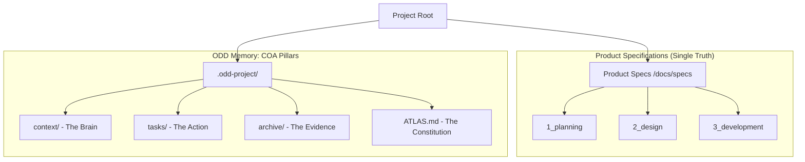

# 🚀 ODD Starter Kit (v1.0.0 COA Edition)

> **"Curing AI Amnesia in Software Development."**
>
> **Order Driven Development (ODD) v1.0.0: The Context-Order-Archive (COA) Architecture**

---

# 🌏 English Guide

## 🛠️ 1. Installation

Run the command below in your terminal. The **Interactive Installer** will guide you through the setup.

```bash
curl -sL https://raw.githubusercontent.com/imincheol/odd-starter/main/odd-template/setup/install.sh | bash
```

### 🌟 Key Features in v1.0.0 (COA)
- **Context-Order-Archive (COA)**: A structured approach to AI memory management.
- **Flexible Path**: Separate your System Memory (ODD) from your Product Specs.
- **Multi-Project Support**: Manage multiple domains (e.g., `fe`, `be`) with isolated memory.
- **Smart Migration**: Automatically detects and upgrades legacy ODD structures to v1.0.0.

### 📂 System Architecture
ODD v1.0.0 separates **"What to build"** (Specs) from **"How/Why we built it"** (Memory).



## 📖 2. User Guide

### 🆕 New Project
1. **Run Installer**: Define your project name and paths.
2. **Setup AI**: Share `{{ODD_DIR}}/setup/ODD_INIT.md` with your AI agent.
3. **Start**: The AI will read the protocol and guide you through discovery.

---

# 🇰🇷 한국어 가이드

## 🛠️ 1. 설치 방법

터미널에서 아래 명령어를 실행하세요. **인터랙티브 설치 프로그램**이 프로젝트 상황에 맞는 최적의 설정을 도와줍니다.

```bash
curl -sL https://raw.githubusercontent.com/imincheol/odd-starter/main/odd-template/setup/install.sh | bash
```

### 🌟 v1.0.0 주요 기능 (COA 아키텍처)
- **COA (Context-Order-Archive)**: 맥락-명령-증거로 이어지는 체계적인 AI 기억 관리.
- **경로 유연화**: 시스템 가이드(ODD)와 제품 기획서(Specs)를 분리하여 관리.
- **다중 프로젝트 지원**: 하나의 레포에서 여러 도메인의 기억을 독립적으로 운영.
- **지능형 이관**: 구버전 ODD 구조를 자동으로 감지하여 최신 체계로 업그레이드.

### 📂 시스템 아키텍처 (Structure Diagram)
ODD v1.0.0은 **"무엇을 만드는가(Specs)"**와 **"어떻게/왜 만들었는가(Memory)"**를 철저히 분리합니다.

```
[Project Root]
 ├── docs/specs/          # 🏛️ Product Specs (무엇을 만드는가)
 │   ├── 1_planning/      #    - 기구축 요구사항 및 정책
 │   ├── 2_design/        #    - UI/UX 설계
 │   └── 3_development/   #    - 기술 아키텍처 및 DB 설계
 │
 └── .odd-project/        # 🧠 ODD Memory: COA Pillars
     ├── ATLAS.md         #    - 프로젝트 헌법 (The Constitution)
     ├── context/         #    - 맥락 (The Brain): 역사, 규약, 로직
     ├── tasks/           #    - 명령 (The Action): 로드맵 및 오더
     ├── archive/         #    - 증거 (The Evidence): 수행 내역 보관
     └── setup/           #    - 운영 프로토콜 (INIT, UPDATE, INSTALL)
```

## 📖 2. 사용 가이드

### 🆕 신규 프로젝트 전용 (ODD INIT)
1. **설치 실행**: 프로젝트 이름과 기억/스펙 경로를 설정합니다.
2. **AI 에이전트 교육**: 생성된 `{{ODD_DIR}}/setup/ODD_INIT.md`를 AI에게 전달합니다.
3. **가동**: AI가 프로토콜을 정독한 뒤, 프로젝트 구축을 자동으로 가이드합니다.

---

## 🧭 3. 참조 가이드 (페르소나)

| Component | Persona | Purpose |
| :--- | :--- | :--- |
| **`@student`** | **학생** | 오더(Order) 수행 및 실시간 로그 기록 |
| **`@auditor`** | **감찰관** | 맥락(Context) 최신화 및 오더 정당성 검토 |
| **`@professor`** | **교수** | 기획 의도 정의 및 오더 최종 승인 |

## 💡 유용한 팁

*   **아틀라스(Atlas) 우선**: 모든 세션 시작 시 `ATLAS.md`를 먼저 로드하여 AI의 자아를 고정하세요.
*   **맥락 수호**: 에이전트가 제멋대로 행동한다면 `context/protocols/`에 정의된 원칙을 상기시키세요.
*   **독립된 기억**: `install-fe.sh` 등을 따로 관리하여 도메인 간 기억 혼선을 방지하세요.
